# IaC 실습 전 환경 구성

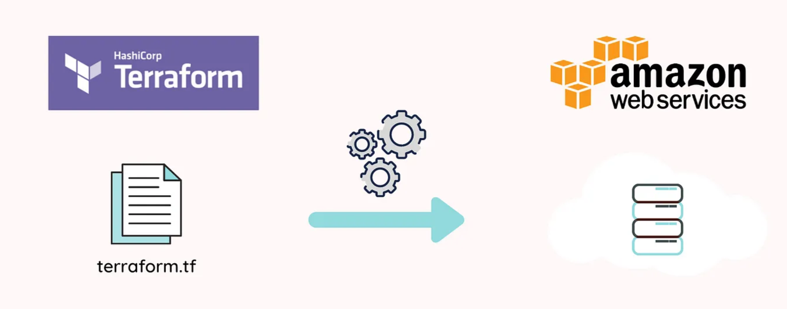

이 페이지는 **Terraform 코드 실행에 앞서, 시나리오 실습 환경을 자동화하기 위해 필요한 기본 도구(Terraform, AWS CLI)의 설치 및 설정 방법**을 안내합니다.

워크북의 AWS 리소스를 **콘솔이 아닌 코드로 자동 생성**하려면, 로컬 환경에 Terraform과 AWS CLI를 **순서대로 설치한 후 인증 정보를 설정**해야 합니다.

## Terraform 설치

## **테라폼(Terraform) 설치 링크**

https://developer.hashicorp.com/terraform/install#windows

## **1. Mac(맥)에서 테라폼 설치**

**STEP 1) Homebrew version 확인**

`homebrew --version`

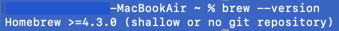

<aside>

터미널을 열어 위 명령어를 입력해 **Homebrew 설치 여부를 확인**합니다. 
설치되어 있다면, 위 사진과 같이 결과가 출력됩니다.

만약 `"command not found"`이면 Homebrew가 설치되지 않은 상태로 아래 단계(STEP 2)의 명령어로 설치해 줍니다.

</aside>

**STEP 2) Homebrew 설치**

```bash
/bin/bash -c "$(curl -fsSL https://raw.githubusercontent.com/Homebrew/install/HEAD/install.sh)"
```

<aside>

설치 후, 다음을 입력해 `brew` 명령어를 사용할 수 있도록 경로를 설정합니다.

</aside>

```bash
echo 'eval "$(/opt/homebrew/bin/brew shellenv)"' >> ~/.zprofile
eval "$(/opt/homebrew/bin/brew shellenv)"
```

**STEP 3) Terraform 설치**

<aside>

터미널을 열어 다음 명령어를 차례대로 입력합니다.

</aside>

```bash
brew tap hashicorp/tap
brew install hashicorp/tap/terraform
```

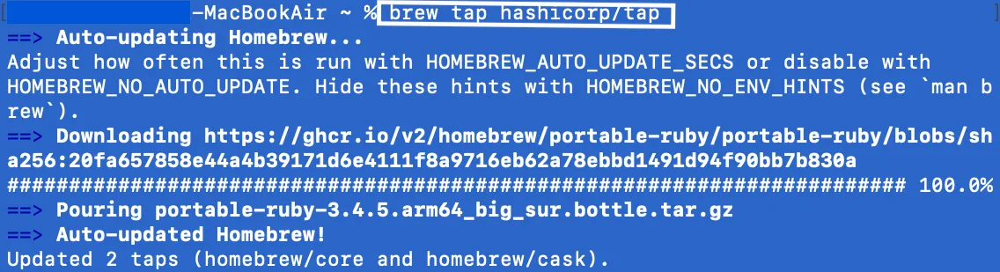
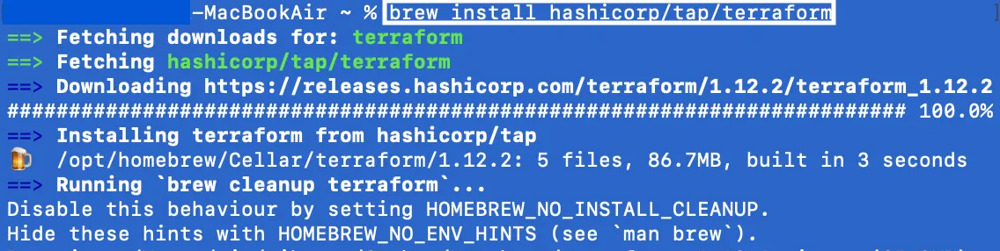

**STEP 3) Terraform 설치 확인**

`terraform --version`

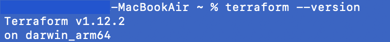

<aside>

설치 후, 터미널을 열고 `terraform --version` 명령어로 설치를 확인합니다. 버전이 정상 출력되면 성공입니다.

</aside>

## **2. Windows(윈도우)에서 테라폼 설치**

**STEP 1) Terraform 파일 다운로드**

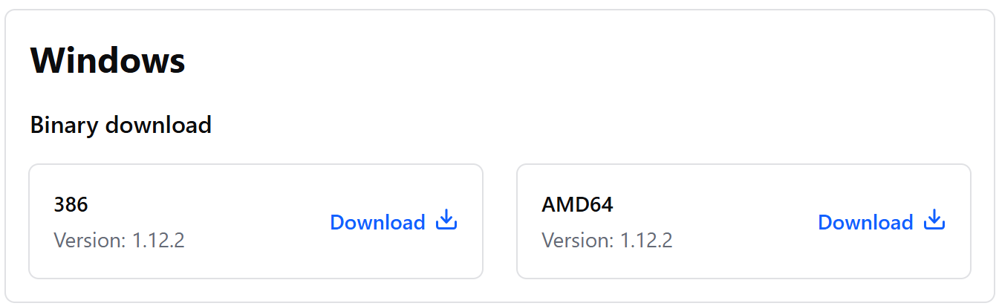

<aside>

[테라폼 공식 다운로드 페이지](https://developer.hashicorp.com/terraform/install)에 접속해 Windows(64bit or 32bit) 압축 파일을 다운로드합니다.

- **386 : 32비트용 버전**
- **AMD64: 64비트용 버전**
</aside>

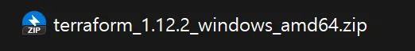


<aside>

압축을 해제해서 **`terraform.exe`** 파일을 **`C:\terraform`** 폴더에 저장합니다.

</aside>

**STEP 2) 환경 변수 설정**

- "내 컴퓨터" 우클릭 → "속성" → "고급 시스템 설정" → "환경 변수"
    
    
    
- "시스템 변수"에서 **`Path`** 선택 후 "편집"
    
    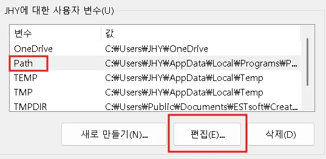
    
- 새로 만들기에 **`C:\terraform`** 폴더 경로 추가 → 저장
    
    
    

**STEP 3) Terraform 설치 확인**

`terraform -version`


<aside>

명령 프롬프트(cmd)나 PowerShell 새 창을 열고 `terraform -version` 명령어로 설치를 확인합니다. 버전이 정상 출력되면 성공입니다.

</aside>

## 3. 리눅스에서 설치

**STEP 1) Terraform 다운로드**

**[ 링크 복사 ]**


```bash
# 버전/아키텍처에 맞게 링크 변경
wget https://releases.hashicorp.com/terraform/1.12.0/terraform_1.12.0_linux_amd64.zip
```

<aside>

[테라폼 공식 다운로드 페이지](https://developer.hashicorp.com/terraform/install)에 접속해 아키텍처에 맞는 바이너리 **파일 다운로드 링크를 복사**합니다.

</aside>

**[ wget 다운로드 ]**

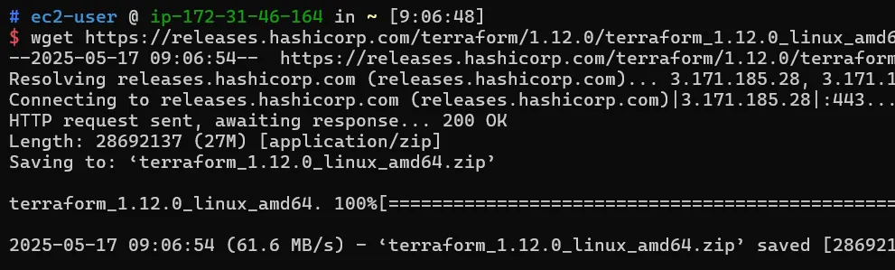

<aside>

복사한 **파일 다운로드 링크**를 터미널에서 wget으로 다운로드합니다.

</aside>

**STEP 2) 압축 해제**

```bash
# 압축 해제
unzip terraform_1.12.0_linux_amd64.zip
```

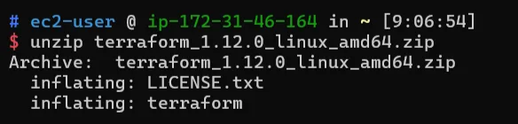

<aside>

다운로드한 zip을 압축을 해제합니다.

**`unzip`** 명령어가 없다면, 각 배포판에 맞는 패키지 매니저(`sudo apt install unzip`, `sudo yum install unzip` 등)로 설치 후 사용합니다.

</aside>

→ 이 과정을 거치면 **terraform** 실행 파일이 생깁니다

**STEP 3) 환경 변수 설정**

```bash
# 환경 변수 경로 확인
echo $PATH

# 실행 파일을 $PATH에 있는 디렉터리로 이동 (예: /usr/local/bin)
sudo mv terraform /usr/local/bin/
```

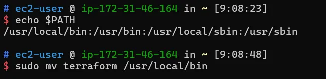

<aside>

위에서 생성된 terraform 실행파일을 PATH에 포함된 디렉터리로 옮깁니다. 

</aside>

**STEP 4) Terraform 설치 확인**

```bash
# 설치 확인
terraform -version
```


<aside>

터미널 창에서 `terraform -version` 명령어로 설치를 확인합니다. 버전이 정상 출력되면 성공입니다.

</aside>

## AWS CLI 설정

## AWS CLI**설치 링크**

https://docs.aws.amazon.com/ko_kr/cli/latest/userguide/getting-started-install.html

**STEP 1) AWS CLI 설치**


<aside>

AWS 리소스를 다루기 위한 CLI 툴로 [AWS CLI 설치 페이지](https://docs.aws.amazon.com/ko_kr/cli/latest/userguide/getting-started-install.html) (Window, macOS) 링크로 접속하여 자신의 환경에 맞는 파일을 설치해줍니다.

CLI가 설치되어 있는 실습자는 **STEP 2) 액세스 키 생성**으로 이동합니다.

</aside>

- **Window**
    
    
    
    **[ AWS 버전 확인 ]**
    
    ```bash
    aws --version
    ```
    
    
    
- **macOS**
    
    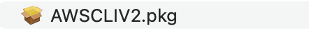
    
    ```bash
    # macOS 환경내 aws cli 설치 명령어
    # symlink의 기본 위치는 /usr/local/bin/
    sudo ln -s /folder/installed/aws-cli/aws /usr/local/bin/aws 
    sudo ln -s /folder/installed/aws-cli/aws_completer /usr/local/bin/aws_completer
    ```
    
    **[ AWS 버전 확인 ]**
    
    ```bash
    aws --version
    ```
    
    
    

**STEP 2) 액세스 키 생성**


<aside>

콘솔로 먼저 생성 후 CLI 에서 진행하면 됩니다.

**Users → 개인 IAM계정 클릭 → Create access key**에 들어갑니다.

</aside>

**[ 액세스 키 모범 사례 및 대안 ]**


<aside>

CLI선택 후 **Next**을 클릭하여 액세스 키를 생성합니다.

- **Use case** : CLI
</aside>

[ 태그 설정 - 옵션]


<aside>

설정 안하고 넘어가도 상관없습니다.

</aside>

**[ 액세스 키 복사 ]**


<aside>

생성된 액세스 키를 확인합니다.

</aside>

**STEP 3) AWS 계정 연결**

```bash
aws configure
```

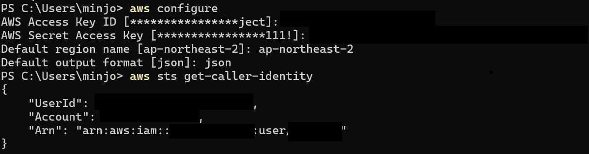

▲ window

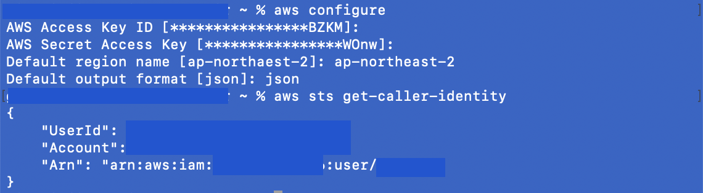

▲ macOS

<aside>

**`aws configure`** AWS CLI가 사용할 인증 정보(AWS 자격 증명)를 로컬 환경에 저장합니다.

- **AWS Access Key ID** : 위에서 생성한 액세스 키
- **AWS Secret Access Key** : 위에서 생성한 비밀 액세스 키
- **Default region name** : 원하는 기본 리전으로 설정
- **Default output format** : json
</aside>

**[ AWS 계정 연결 확인 ]**

```bash
aws configure list
```


▲ window

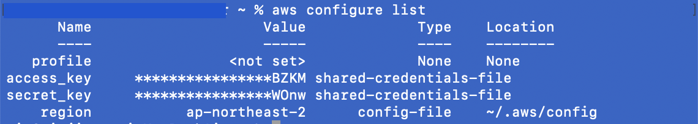

▲ macOS

<aside>

위 사진과 같이 출력되었다면 성공적으로 계정 연결이 된 것입니다.

</aside>

[ **테라폼에서 여러 계정을 사용 할 경우 - 옵션 ]**

```bash
aws configure --profile [계정명]
```

<aside>

이 방식은 **여러 계정을 동시에 관리 가능**하고, 깔끔하게 분리됩니다.

</aside>

CLI 설정까지 마쳤다면 실습 환경이 정상적으로 준비되었습니다.

이제 Terraform 코드를 적용하여 AWS 리소스를 자동으로 구성할 수 있습니다.
